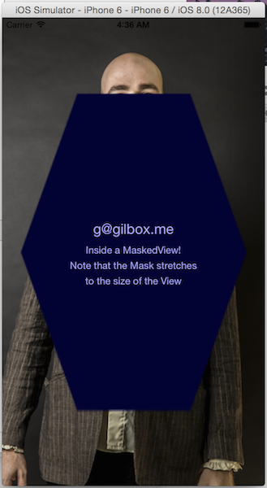

# react-native-masked-view

Masked View Component for React. Just like a `<View />` with a mask.

    <MaskedView maskImage="mask.png">...</MaskedView>

## installation

    npm install react-native-masked-view

... then have a look at [these instructions](https://github.com/chirag04/react-native-dashed-border)
and adjust accordingly.

## options

- `maskImage`: File name of image asset added to Images.xcassets.
[See React Docs for instructions on adding images.](https://facebook.github.io/react-native/docs/image.html#adding-static-resources-to-your-app-using-images-xcassets)
